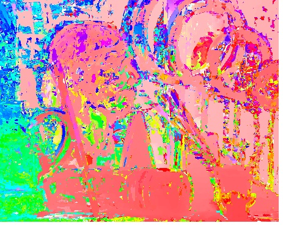
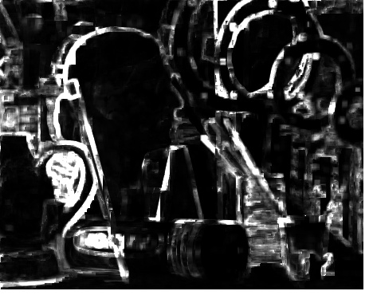
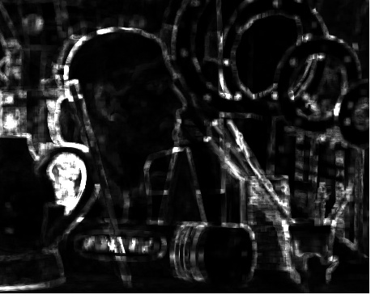
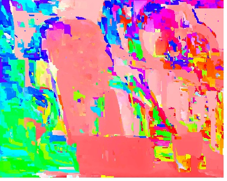

# NanoPM, single header only PatchMatch
**NanoPM** is a single header-only implementation of PatchMatch algorithm written in C++. Could be used for variety of applications.

| |PatchMatch (350 ms.)|BruteForce as Ground Truth (18 min.)|
|---|---|---|
|NNF (Nearest Neighbor Field) |||
|Distance|||

## Example applications

- dense optical flow

|src|dst|optical flow|
|---|---|---|
||||

- image synthesis (WIP)
- inpainting (WIP)

# Dependencies
## Mandatory
- None
## Optional
- OpenCV
    - cv::Mat_ as Image class. Image I/O
- stb
    https://github.com/nothings/stb
    - Image I/O
- LodePNG
    https://github.com/lvandeve/lodepng
    - .png I/O particularly for 16bit writing that is not supported by stb
- tinycolormap
    https://github.com/yuki-koyama/tinycolormap
    - Colorization.
- OpenMP
    (if supported by your compiler)
    - Multi-thread accelaration

# Reference
- Barnes, Connelly, et al. "PatchMatch: A randomized correspondence algorithm for structural image editing." ACM Transactions on Graphics (ToG). Vol. 28. No. 3. ACM, 2009.

# Data
Borrowed Middlebury Stereo Datasets. Original data is from
http://vision.middlebury.edu/stereo/data/scenes2005/ThirdSize/zip-2views/ALL-2views.zip
- D. Scharstein and C. Pal. Learning conditional random fields for stereo.
In IEEE Computer Society Conference on Computer Vision and Pattern Recognition (CVPR 2007), Minneapolis, MN, June 2007.
- H. Hirschmüller and D. Scharstein. Evaluation of cost functions for stereo matching.
In IEEE Computer Society Conference on Computer Vision and Pattern Recognition (CVPR 2007), Minneapolis, MN, June 2007.

